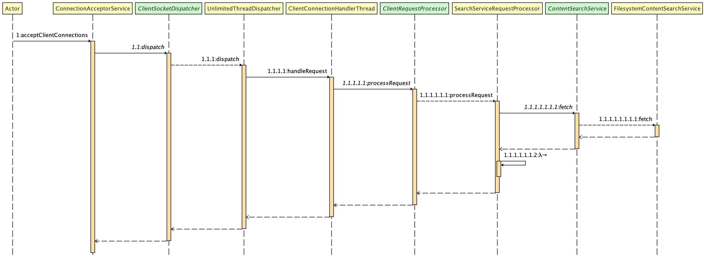
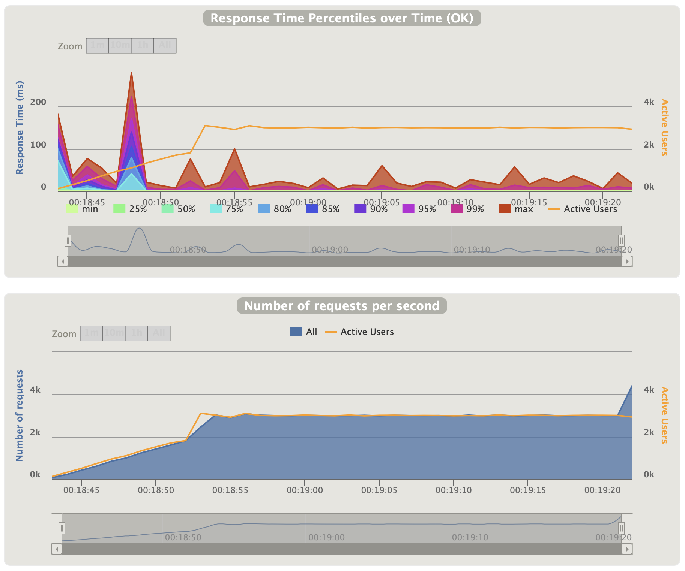

# :icecream: vanilla-http-server

Simple but functional implementation of a http-server without a http framework in vanilla
java. [Why vanilla?](https://thisinterestsme.com/vanilla-javascript/)

## :whale2: How to launch?

The vanilla-http-server is available as a docker image
on [DockerHub](https://hub.docker.com/repository/docker/lukashavemann/vanilla-http-server) and can be started with the
following command. After startup the container will start serving files form a sample directory inside the docker image
on `localhost:8080`.

```
docker run -d -p 8080:8080 lukashavemann/vanilla-http-server:latest
```

To serve files from the host system, you can use a [bind mount](https://docs.docker.com/storage/bind-mounts/). In the
following example the vanilla-http-server will serve files from the current working directory.

```
docker run -d \
    -p 8080:8080 \
    --mount type=bind,source="$(pwd)",target=/basedir \
    lukashavemann/vanilla-http-server:latest
```

If you want to override the default configuration of the vanilla-http-server container instance, you can pass
configuration properties as command line arguments. In the following example the http connection keep-alive-timeout will
be increased to 25 seconds. [See here](/src/main/resources/default-application.yml) for a full documentation of all
possible configuration parameters.

````
docker run -d \
    -p 8080:8080 lukashavemann/vanilla-http-server:latest \
    --vanilla.server.http.keepAliveTimeout=25s
````

## :package: Dependencies

The vanilla-http-server uses spring boot starter for dependency injection and configuration management. The web context
of spring boot **[is disabled](src/main/java/de/havemann/lukas/vanillahttp/VanillaHttpServer.java)**.
The [http protocol](src/main/java/de/havemann/lukas/vanillahttp/protocol)
implementation was built from. The html testing framework [jsoup](https://jsoup.org) is used for automated acceptance
testing.

## :house: Architecture

The vanilla-http-server uses a simple blocking execution model. The main components and their interaction, are shown in
the following sequence diagram.



### Description

The [`ConnectionAcceptorService`](src/main/java/de/havemann/lukas/vanillahttp/server/ConnectionAcceptorService.java)
accepts new tcp connections. After successful initialization of the client socket, the socket is passed to
a [`ClientSocketDispatcher`](src/main/java/de/havemann/lukas/vanillahttp/dispatcher/ClientSocketDispatcher.java), which
is responsible for handling the client socket. With
[`UnlimitedThreadDispatcher`](src/main/java/de/havemann/lukas/vanillahttp/dispatcher/UnlimitedThreadDispatcher.java)
there is only one simple implementation of
the [`ClientSocketDispatcher`](src/main/java/de/havemann/lukas/vanillahttp/dispatcher/ClientSocketDispatcher.java)
interface at the moment.

The [`UnlimitedThreadDispatcher`](src/main/java/de/havemann/lukas/vanillahttp/dispatcher/UnlimitedThreadDispatcher.java)
spawns a new `ClientConnectionHandlerThread` which is responsible for handling the client socket and managing the http
keep-alive feature. The `ClientConnectionHandlerThread`passes successfully
parsed [`HttpRequest`](src/main/java/de/havemann/lukas/vanillahttp/protocol/request/HttpRequest.java) to an instance
of [`ClientRequestProcessor`](src/main/java/de/havemann/lukas/vanillahttp/dispatcher/ClientRequestProcessor.java).

With [`SearchServiceRequestProcessor`](src/main/java/de/havemann/lukas/vanillahttp/search/SearchServiceRequestProcessor.java)
there is only on implementation of said interface.
The [`SearchServiceRequestProcessor`](src/main/java/de/havemann/lukas/vanillahttp/search/SearchServiceRequestProcessor.java)
does handle the eTag evaluation and uses
the [`ContentSearchService`](src/main/java/de/havemann/lukas/vanillahttp/search/ContentSearchService.java) instance to
find the requested
resource. [`FilesystemContentSearchService`](src/main/java/de/havemann/lukas/vanillahttp/search/FilesystemContentSearchService.java)
is the only implementation of
the [`ContentSearchService`](src/main/java/de/havemann/lukas/vanillahttp/search/ContentSearchService.java) interface at
the moment.

### Summary

In summary the architecture of the vanilla-http-server foresees the following possible extension points:

- A more
  intelligent [`ClientSocketDispatcher`](src/main/java/de/havemann/lukas/vanillahttp/dispatcher/ClientSocketDispatcher.java)
  could be implemented, which uses a dynamic thread pool which grows and shrinks according to the load but always has a
  specific number of active client socket handling threads.
- A
  different [`ClientRequestProcessor`](src/main/java/de/havemann/lukas/vanillahttp/dispatcher/ClientRequestProcessor.java)
  could be implemented, to build a simple application server for dynamic content generation.

- A different  [`ContentSearchService`](src/main/java/de/havemann/lukas/vanillahttp/search/ContentSearchService.java)
  could be implemented, to search for resources in a database or s3 service etc.

## :test_tube: Unittests & Acceptancetest

Critical classes are tested with JUnit, Mockito and AssertJ. All requirements are validated end-to-end with automated
acceptance tests. The capability to stream large files was manually tested.

* [Basic Reguirements Acceptancetest](src/test/java/de/havemann/lukas/vanillahttp/acceptancetest/BasicRequirementsAcceptanceTest.java)
* [Extension 1 Acceptancetest](src/test/java/de/havemann/lukas/vanillahttp/acceptancetest/Extension1AcceptanceTest.java)
* [Extension 2 Acceptancetest](src/test/java/de/havemann/lukas/vanillahttp/acceptancetest/Extension2AcceptanceTest.java)

## :gun: Loadtesting

To validate that the vanilla-http-server can serve multiple concurrent request, a simple [Gatling](https://gatling.io/)
loadtest
scenario [is included in the project](src/test/scala/de/havemann/lukas/vanillahttp/SimpleVanillaRequestSimulation.scala). The loadtest driver can be started with ```mvn gatling:test```. When the loadtest has completed a html report with the
result of the loadtest can be found under ```target/gatling/simple*/index.html```.

On a Macbook Air M1, 2020, 16GB, macOS big sur 11.2 the following loadtest result could be achieved. The
vanilla-http-server was able to serve _3000 req/sec_ with a 99th percentile of _13ms_. On higher request rates requests
started to fail due to many open files. There seams to be no resource leak, and the response times were good, so no
further tuning and testing was done.

In the following histogram you can see the distribution of the response-time percentiles. During the ramp-up phase, the
vanilla-http-server spawns a lot of new client connection handling threads. The spawning leads to response percentile
spikes, which could be prevented by a more
intelligent  [`ClientSocketDispatcher`](src/main/java/de/havemann/lukas/vanillahttp/dispatcher/ClientSocketDispatcher.java) .



## :hammer: Development, Build & Pipeline

To build and run the project locally.

```
mvn clean package
java -jar target/vanilla-http-server-1.0-SNAPSHOT.jar
```

For local analyzing and debugging of the http protocol implementation [Wireshark](https://www.wireshark.org/) was used.

The execution of the unit and acceptance tests were automated
with [GitHub Actions](https://github.com/LukasHavemann/vanilla-http-server/actions). The docker image build is automated
with [DockerHub](https://hub.docker.com/repository/docker/lukashavemann/vanilla-http-server). As soon as a new merge to
master happens, a new docker image is built by DockerHub cloud and provided with latest tag in
the [DockerHub registry](https://hub.docker.com/repository/docker/lukashavemann/vanilla-http-server).

The docker image is built as a multi-stage build. The maven build process produces
a [layered jar](https://docs.spring.io/spring-boot/docs/current/maven-plugin/reference/htmlsingle/#repackage-layers).
During build process the layered jar gets unpacked and added as separate layers, to make use of the docker layer
deduplication feature to reduce server startup time.

## :book: Used Online Resources

During development the following online resources were used.

- [maven github actions setup](https://docs.github.com/en/actions/guides/building-and-testing-java-with-maven)
- [jetbrains gitignore](https://github.com/github/gitignore/blob/master/Global/JetBrains.gitignore)
- [maven gitignore](https://github.com/github/gitignore/blob/master/Maven.gitignore)
- [docker github actions setup](https://github.com/marketplace/actions/build-and-push-docker-images)
- [switch to multi stage build](https://stackoverflow.com/questions/61388905/github-action-to-maven-build-followed-by-docker-build-push)
- [switch to layered jar](https://spring.io/blog/2020/01/27/creating-docker-images-with-spring-boot-2-3-0-m1)
- [RFC 2616](https://tools.ietf.org/html/rfc2616)
- [RFC 7232](https://tools.ietf.org/html/rfc7232)
- [Mozilla http header documentation](https://developer.mozilla.org/en-US/docs/Web/HTTP/Headers)
- and multiple stackoverflow answers to some minor implementation details